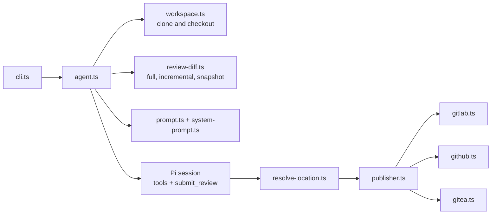

<a href="https://zerodha.tech"></a>

# Hodor

> Agentic code reviewer for GitHub PRs, GitLab MRs, Gitea/Forgejo PRs, and local diffs.

Hodor checks out the change, gives an LLM agent inspection tools (read, grep, find, ls, and a shell for git), and asks it for structured findings. It posts them as inline comments and a rolling summary, or prints them locally.

## Install

```bash
# Just run it (zero install, always latest)
npx @mrkaran/hodor <PR_URL>

# Or install globally
npm install -g @mrkaran/hodor
```

Docker images are published at `ghcr.io/mr-karan/hodor:<version>` for CI. Pin a version in CI so reviews stay comparable across runs.

## Setup

```bash
# Set an API key for your LLM provider
export ANTHROPIC_API_KEY=sk-...     # Anthropic (default)
export OPENAI_API_KEY=sk-...        # OpenAI
export OPENROUTER_API_KEY=sk-or-... # OpenRouter (e.g., Kimi K2.6)
export AWS_PROFILE=default          # AWS Bedrock (AWS credential chain)

# For posting reviews as comments
gh auth login                     # GitHub
glab auth login                   # GitLab

# For Gitea/Forgejo private repos or posting comments
export GITEA_TOKEN=your-token     # or FORGEJO_TOKEN
```

## Usage

```bash
# Review a GitHub PR
npx @mrkaran/hodor https://github.com/owner/repo/pull/123

# Review a GitLab MR (including self-hosted)
npx @mrkaran/hodor https://gitlab.example.com/org/project/-/merge_requests/42

# Review a Gitea or Forgejo PR
npx @mrkaran/hodor https://git.example.com/owner/repo/pulls/123

# Post the review as a PR/MR comment
npx @mrkaran/hodor <PR_URL> --post

# Use a different model
npx @mrkaran/hodor <PR_URL> --model anthropic/claude-opus-5-5
npx @mrkaran/hodor <PR_URL> --model openai/gpt-6-sol
npx @mrkaran/hodor <PR_URL> --model bedrock/converse/global.anthropic.claude-opus-5-5

# Extended reasoning for complex PRs
npx @mrkaran/hodor <PR_URL> --reasoning-effort high

# Force a full review of the entire branch (ignore previous incremental reviews)
npx @mrkaran/hodor <PR_URL> --full

# Verbose mode (watch the agent think)
npx @mrkaran/hodor <PR_URL> -v
```

> If you installed globally with `npm install -g`, replace `npx @mrkaran/hodor` with `hodor`.

## Review instructions

Choose the default review profile, a custom security profile, or a one-off focus for a review:

```bash
# Default profile
npx @mrkaran/hodor <PR_URL>

# Custom profile that replaces the bundled default
npx @mrkaran/hodor <PR_URL> \
  --review-instructions ./review-profiles/security.md

# One-off request added after the selected profile
npx @mrkaran/hodor <PR_URL> \
  --additional-instructions "Focus on authorization changes in the admin API."
```

A review profile applies to the whole run. A custom profile replaces the bundled default profile. Additional instructions are additive. Repository-specific rules remain in `.agents/skills/` and are used when relevant. Hodor's review rules take precedence if these inputs conflict.

See [Review instructions](./docs/REVIEW_INSTRUCTIONS.md) for complete security and code-quality profiles, local and CI examples, migration guidance, and file validation troubleshooting.

## Local Mode

Review local git changes without a PR URL. Useful for pre-push reviews, Bitbucket PRs, or any git repo.

```bash
# Review uncommitted changes against origin/main (default)
npx @mrkaran/hodor --local

# Review against a specific branch or ref
npx @mrkaran/hodor --local --diff-against develop
npx @mrkaran/hodor --local --diff-against HEAD~3

# Review a feature branch against main
git checkout feature-branch
npx @mrkaran/hodor --local --diff-against origin/main

# Use a specific workspace directory
npx @mrkaran/hodor --local --workspace /path/to/repo

# Combine with other flags
npx @mrkaran/hodor --local --diff-against origin/main --model openai/gpt-6-sol -v
```

Local mode:
- Includes **uncommitted changes** (staged + unstaged), not just commits
- Auto-resolves to the **git repo root** (works from subdirectories)
- Skips PR metadata fetching and workspace cloning
- `--post` is disabled (no remote to post to)

## CLI Flags

| Flag | Default | Description |
|------|---------|-------------|
| `--model` | `anthropic/claude-opus-5-5` | LLM model as `provider/model-id`. Tested: Anthropic, OpenAI, Bedrock, OpenRouter. Other Pi providers are best-effort. See [docs/MODELS.md](./docs/MODELS.md). |
| `--reasoning-effort` | Adaptive | `minimal`, `low`, `medium`, `high`, or `xhigh`. Without it, Hodor picks a level per review (see [Token optimization](#token-optimization)). |
| `--ultrathink` | Off | Maximum reasoning effort |
| `--full` | Off | Review the entire source-vs-target diff from scratch, ignoring previous hodor reviews (disables incremental mode) |
| `--target-branch` | None | Override the target branch to diff against under `--full` (default: the PR/MR's target branch) |
| `--local` | Off | Review local git changes (no PR URL required) |
| `--diff-against` | `origin/main` | Git ref to diff against in `--local` mode |
| `--post` | Off | Post review as a comment on the PR/MR |
| `--review-style` | `hybrid` | GitLab posting style: rolling `summary`, `inline`, or both with `hybrid` |
| `--code-quality` | None | Write a Code Quality report containing current and unresolved Hodor findings |
| `--commit-status` | Off | Post a pass/fail status based on all unresolved Hodor findings |
| `--require-delivery` | Off | Exit non-zero if requested comments, statuses, or artifacts are not delivered |
| `--fail-on-priority` | None | Exit non-zero for findings at or above `P0`, `P1`, `P2`, or `P3` |
| `--review-instructions` | None | Read a custom review profile from a file. It replaces the bundled default profile for this run. |
| `--additional-instructions` | None | Add one-off review instructions after the selected profile. |
| `--workspace` | Temp dir | Workspace directory (reuse for faster multi-PR reviews) |
| `--bedrock-tags` | None | JSON `requestMetadata` for filtering Bedrock invocation logs. Not billing tags; see [Bedrock cost attribution](./docs/MODELS.md#application-inference-profiles-cost-attribution). |
| `--prometheus-push` | None | Push review metrics to a Prometheus Pushgateway or VictoriaMetrics import endpoint |
| `--tiny-diff-fast-path` | Off | For tiny, low-risk, fully embedded diffs, decide in one turn with no repository exploration (cheaper) |
| `-v, --verbose` | Off | Stream agent reasoning and tool calls |

## Environment Variables

| Variable | Purpose |
|----------|---------|
| `ANTHROPIC_API_KEY` | Claude API key |
| `OPENAI_API_KEY` | OpenAI API key |
| `OPENROUTER_API_KEY` | OpenRouter API key (for `openrouter/...` models, e.g. `openrouter/moonshotai/kimi-k2.6`) |
| Provider-specific keys | For best-effort pi-ai providers, use the env var pi-ai expects (e.g. `MISTRAL_API_KEY`, `GEMINI_API_KEY`, `XAI_API_KEY`, `GROQ_API_KEY`) |
| `LLM_API_KEY` | Generic key. When set, it is used instead of the provider-specific key. |
| `GITHUB_TOKEN` / `GITLAB_TOKEN` | Post comments to GitHub PRs / GitLab MRs (with `--post`) |
| `GITEA_TOKEN` / `FORGEJO_TOKEN` | Read private repos and post comments on Gitea/Forgejo PRs |
| `GITEA_HOST` / `FORGEJO_HOST` | Hostname for Gitea/Forgejo when not inferable from a full PR URL |
| `AWS_PROFILE` or `AWS_ACCESS_KEY_ID` | AWS Bedrock auth through the AWS credential chain |
| `AWS_REGION` | Bedrock region for registry model IDs (ARN models take the region from the ARN) |
| `HODOR_MODELS_JSON` | Path to a trusted Pi `models.json` for custom or self-hosted endpoints. See [Custom endpoints](./docs/MODELS.md#custom-endpoints-hodor_models_json). |

See [docs/MODELS.md](./docs/MODELS.md) for the full model/provider matrix and [docs/OPENROUTER.md](./docs/OPENROUTER.md) for an end-to-end Kimi K2.6 example.

## Gitea / Forgejo

Hodor supports Gitea and Forgejo pull request URLs in this format:

```bash
npx @mrkaran/hodor https://git.example.com/owner/repo/pulls/123
```

For public repositories, metadata fetching may work without a token. Set `GITEA_TOKEN` or `FORGEJO_TOKEN` for private repositories, higher API limits, and `--post`:

```bash
export GITEA_TOKEN=your-token
npx @mrkaran/hodor https://git.example.com/owner/repo/pulls/123 --post
```

Fork PRs are checked out from the PR source repository when Gitea exposes the source clone URL. If the source branch or fork has been deleted, checkout will fail with a workspace error.

## CI/CD

### Metrics in CI

Hodor can push per-review metrics at the end of a CI run to either a Prometheus Pushgateway base URL or a VictoriaMetrics Prometheus import endpoint (`/api/v1/import/prometheus`):

```bash
hodor "$MR_OR_PR_URL" --prometheus-push "$METRICS_PUSH_URL"
```

In CI, set `METRICS_PUSH_URL` as a secret/variable and add `--prometheus-push "$METRICS_PUSH_URL"` to the Hodor command. Metrics are best-effort: push failures are logged as warnings and do not fail the review job.

Each metric is labeled with `platform`, `model`, `verdict`, `outcome`, and for PR/MR URLs also `project` (`owner/repo`). MR/PR numbers are deliberately excluded to avoid unbounded time-series cardinality. Exported metrics include token usage, cache read/write tokens, cache hit ratio, cost, turns, tool calls, duration, and findings by priority (`P0` to `P3`). A generic Grafana dashboard is available in [`docs/grafana/`](./docs/grafana/).

### GitHub Actions

```yaml
name: Hodor Review
on:
  pull_request:
    types: [opened, synchronize]

jobs:
  review:
    runs-on: ubuntu-latest
    container: ghcr.io/mr-karan/hodor:0.8.0
    steps:
      - name: Run Hodor
        env:
          GITHUB_TOKEN: ${{ secrets.GITHUB_TOKEN }}
          ANTHROPIC_API_KEY: ${{ secrets.ANTHROPIC_API_KEY }}
          METRICS_PUSH_URL: ${{ secrets.METRICS_PUSH_URL }} # optional
        run: |
          EXTRA_ARGS=""
          if [ -n "${METRICS_PUSH_URL:-}" ]; then EXTRA_ARGS="--prometheus-push $METRICS_PUSH_URL"; fi
          bun run /app/dist/cli.js "https://github.com/${{ github.repository }}/pull/${{ github.event.pull_request.number }}" --post $EXTRA_ARGS
```

### GitLab CI

```yaml
# .gitlab-ci.yml
workflow:
  rules:
    - if: $CI_PIPELINE_SOURCE == "merge_request_event"

hodor-review:
  stage: test
  image:
    name: ghcr.io/mr-karan/hodor:0.8.0
    entrypoint: [""]
  variables:
    HODOR_MODEL: "anthropic/claude-opus-5-5"
  before_script:
    - glab auth login --hostname $CI_SERVER_HOST --token $GITLAB_TOKEN
  script:
    - MR_URL="${CI_PROJECT_URL}/-/merge_requests/${CI_MERGE_REQUEST_IID}"
    - |
      EXTRA_ARGS=""
      if [ -n "${METRICS_PUSH_URL:-}" ]; then EXTRA_ARGS="--prometheus-push $METRICS_PUSH_URL"; fi
      bun run /app/dist/cli.js "$MR_URL" --model "$HODOR_MODEL" --post --code-quality gl-code-quality-report.json --commit-status $EXTRA_ARGS
  artifacts:
    expose_as: "Hodor findings"
    paths:
      - gl-code-quality-report.json
    reports:
      codequality: gl-code-quality-report.json
    when: always
  allow_failure: true
  timeout: 15m
```

This posts actionable findings inline, updates one rolling summary note with collapsed run metrics, sets a commit status from all unresolved Hodor findings, and exposes the cumulative Code Quality report from the MR.

See [AUTOMATED_REVIEWS.md](./docs/AUTOMATED_REVIEWS.md) for advanced workflows.

## Token optimization

Hodor automatically optimizes token usage:

- **Diff embedding**: For PRs under 200KB, the diff is embedded directly in the prompt, cutting agent turns from ~60 to ~5.
- **Incremental reviews**: On re-runs, only reviews changes since the last hodor comment. After a force-push or rebase, Hodor compares the last reviewed snapshot directly with the current HEAD instead of reviewing the whole MR again.
- **Identical-HEAD reuse**: Successful summaries include a versioned, compressed review payload. Pipeline retries with the same MR/PR, target branch and base commit, HEAD, model, reasoning request, review profile, and additional instructions reuse that result while still regenerating artifacts and retrying delivery.
- **Adaptive reasoning**: Models that default to `xhigh` (Opus 4.7 and later) use `high` for incremental reviews and small diffs (10 files or fewer, 500 changed lines or fewer). High-risk, large, and `--full` reviews keep `xhigh`. An explicit `--reasoning-effort` always wins.
- **Focused exploration**: Embedded diffs include a changed-file manifest and direct the agent toward bounded context reads without limiting how far it may investigate.
- **Compaction**: Hodor auto-summarizes older conversation turns when context grows too large.
- **Prompt caching**: Supported models (Claude on Anthropic and Bedrock, and others that Pi marks as cacheable) reuse the cached prompt prefix across turns. Cache reads usually make up most of a review's input tokens.

Pass `--full` to bypass incremental mode and identical-HEAD reuse. Pass `--reasoning-effort` to override adaptive reasoning.

## Skills

Hodor discovers repository-specific review guidelines from `.agents/skills/`, the cross-client Agent Skills convention:

```bash
mkdir -p .agents/skills/review-guidelines
```

```markdown
# .agents/skills/review-guidelines/SKILL.md
---
name: review-guidelines
description: Security and performance review checklist.
---

- All API endpoints must have authentication checks.
- Database queries must use parameterized statements.
- API responses should be < 200ms p95.
```

Skills are loaded automatically during reviews. See [SKILLS.md](./docs/SKILLS.md) for details.

## Security model

Hodor reviews untrusted code, so plan CI permissions around these facts:

- **The agent has a shell.** Besides read, grep, find, and ls, the agent can run shell commands (for git). The review protocol forbids changes, but the protocol is a prompt, not a sandbox. Commands inherit Hodor's environment, including API keys and platform tokens.
- **Give Hodor least-privilege credentials.** Use a token scoped to comments and statuses, a dedicated bot account, and short-lived cloud credentials. Restrict network egress from the runner where you can. Rotate keys and keep audit logging on.
- **Diffs and repository text are untrusted input.** Treat a review as advice. Keep `allow_failure` and human approval in the merge path.
- **Hodor trusts only its own notes.** Review SHAs, cached reviews, prior review context, and inline discussions are read back only from notes written by the account Hodor posts as: the numeric user id behind the GitLab, Gitea, or GitHub token (`gh api user` on GitHub). Set `HODOR_GITHUB_BOT_LOGIN` to name the GitHub account explicitly; Hodor resolves it to its id. In GitHub Actions, Hodor falls back to the id of `github-actions[bot]`, which every workflow in the repository shares; use a dedicated app or bot account to isolate Hodor state. If Hodor cannot resolve its identity, it runs a full review with no reuse, and GitLab posting fails instead of guessing.
- **`HODOR_MODELS_JSON` is trusted configuration.** It can run commands and redirect traffic. Never load it from the checkout under review. See [Custom endpoints](./docs/MODELS.md#treat-the-file-as-trusted-code).

## Development

```bash
bun install          # Install dependencies
bun run build        # Build
bun run test         # Run tests
bun run typecheck    # Type check
bun run eval:list    # Validate and list review-quality eval cases
bun run eval -- --model <provider/model> # Execute model evals (uses API credentials)
bun run dev -- <url> # Run from source
```

---

## Architecture

Hodor is written in TypeScript and runs on [Bun](https://bun.sh). The agent runtime is the [Pi](https://github.com/earendil-works/pi) coding-agent SDK.



| Module | Purpose |
|--------|---------|
| `src/cli.ts` | Commander CLI, verbose progress rendering, exit policy |
| `src/agent.ts` | Review orchestration: preflight, workspace, Pi session, `submit_review`, recovery, metrics |
| `src/model.ts` | Model strings, Bedrock ARN models, adaptive reasoning, API keys |
| `src/models-json.ts` | `HODOR_MODELS_JSON` loading and fail-closed validation |
| `src/workspace.ts` | CI detection, cloning, PR/MR checkout |
| `src/platform.ts` | Platform detection and PR/MR URL parsing |
| `src/review-diff.ts` | Diff construction, incremental and snapshot bases, skipped files |
| `src/prompt.ts`, `src/templates.ts` | Review task prompt from `templates/` |
| `src/system-prompt.ts`, `src/review-instructions.ts` | System prompt, review profiles, additional instructions |
| `src/review.ts` | `submit_review` schema and semantic validation |
| `src/review-recovery.ts` | Recovery when a model skips `submit_review` |
| `src/resolve-location.ts` | Snippet-based line resolution ([details](./docs/SNIPPET_LINE_RESOLUTION.md)) |
| `src/review-state.ts` | Finding fingerprints and dedupe against open discussions |
| `src/review-cache.ts` | Identical-HEAD review reuse |
| `src/provenance.ts` | Publishing identity and trusted Hodor note partitioning |
| `src/review-policy.ts` | `--fail-on-priority` evaluation |
| `src/publisher.ts` | Inline notes, rolling summary, commit status, discussion reconciliation |
| `src/gitlab.ts`, `src/github.ts`, `src/gitea.ts` | Platform APIs via `glab`, `gh`, and the Gitea REST API |
| `src/render.ts`, `src/codequality.ts` | Markdown rendering and GitLab Code Quality reports |
| `src/metrics.ts` | Token, cost, and duration metrics; Prometheus push |
| `src/evaluation.ts`, `scripts/run-evals.ts`, `evals/` | Review-quality evals |
| `templates/` | Default review profile and review task template |

---

## Learn More

### Hodor Documentation
- **[MODELS.md](./docs/MODELS.md)** - Providers, reasoning, Bedrock inference profiles, custom endpoints
- **[OPENROUTER.md](./docs/OPENROUTER.md)** - End-to-end OpenRouter example
- **[REVIEW_INSTRUCTIONS.md](./docs/REVIEW_INSTRUCTIONS.md)** - Review profiles and additional instructions
- **[SKILLS.md](./docs/SKILLS.md)** - Repository-specific review guidelines
- **[AUTOMATED_REVIEWS.md](./docs/AUTOMATED_REVIEWS.md)** - Advanced CI/CD workflows
- **[SNIPPET_LINE_RESOLUTION.md](./docs/SNIPPET_LINE_RESOLUTION.md)** - How finding locations are resolved
- **[grafana/](./docs/grafana/)** - Metrics dashboard

### Contributing
Found a bug? Want to add a feature? Open an issue at https://github.com/mr-karan/hodor/issues.

---
## License

[MIT](./LICENSE)
