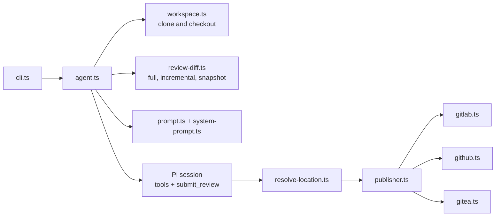

<a href="https://zerodha.tech"></a>

# Hodor

> Agentic code reviewer for GitHub PRs, GitLab MRs, Gitea/Forgejo PRs, and local diffs.

Hodor checks out the change, gives an LLM agent confined inspection tools (`git_diff`, `read`, `grep`, `find`, `ls`) over the tracked repository, and asks it for structured findings. It posts them as inline comments and a summary note, or prints them locally.

## Install

```bash
# Just run it (zero install, always latest)
npx @mrkaran/hodor <PR_URL>

# Or install globally
npm install -g @mrkaran/hodor
```

Docker images are published at `ghcr.io/mr-karan/hodor:<version>` for CI. Pin a version in CI so reviews stay comparable across runs.

## Setup

```bash
# Set an API key for your LLM provider
export ANTHROPIC_API_KEY=sk-...     # Anthropic (default)
export OPENAI_API_KEY=sk-...        # OpenAI
export OPENROUTER_API_KEY=sk-or-... # OpenRouter (e.g., Kimi K2.6)
export AWS_PROFILE=default          # AWS Bedrock (AWS credential chain)

# For posting reviews as comments
gh auth login                     # GitHub
glab auth login                   # GitLab

# For Gitea/Forgejo private repos or posting comments
export GITEA_TOKEN=your-token     # or FORGEJO_TOKEN
```

## Usage

```bash
# Review a GitHub PR
npx @mrkaran/hodor https://github.com/owner/repo/pull/123

# Review a GitLab MR (including self-hosted)
npx @mrkaran/hodor https://gitlab.example.com/org/project/-/merge_requests/42

# Review a Gitea or Forgejo PR
npx @mrkaran/hodor https://git.example.com/owner/repo/pulls/123

# Post the review as a PR/MR comment
npx @mrkaran/hodor <PR_URL> --post

# Use a different model
npx @mrkaran/hodor <PR_URL> --model anthropic/claude-opus-5-5
npx @mrkaran/hodor <PR_URL> --model openai/gpt-6-sol
npx @mrkaran/hodor <PR_URL> --model bedrock/converse/global.anthropic.claude-opus-5-5

# Extended reasoning for complex PRs
npx @mrkaran/hodor <PR_URL> --reasoning-effort high

# Force a full review of the entire branch (ignore previous incremental reviews)
npx @mrkaran/hodor <PR_URL> --full

# Verbose mode (watch the agent think)
npx @mrkaran/hodor <PR_URL> -v
```

> If you installed globally with `npm install -g`, replace `npx @mrkaran/hodor` with `hodor`.

## Review instructions

Commit project code conventions in `AGENTS.md`. Hodor automatically loads root and applicable nested guidance from the target branch, with `CLAUDE.md` as a per-directory fallback. No CI flag is needed. Add shared instructions or a one-off focus when needed:

```bash
# Baseline review plus automatic project guidance
npx @mrkaran/hodor <PR_URL>

# Add shared review rules from a file
npx @mrkaran/hodor <PR_URL> \
  --instructions /etc/hodor/security.md

# One-off focus, optionally narrowing reporting
npx @mrkaran/hodor <PR_URL> \
  --focus "Focus on authorization changes in the admin API."
```

Instruction files are additive and repeatable. Later files win conflicts, and focus wins conflicts with files. Explicit reviewer instructions can narrow reporting, for example, `--focus "Report only security findings."` Repository guidance adds scoped conventions but cannot suppress baseline defect checks. Hodor's fixed review protocol always wins. Repository skills remain optional context loaded when relevant.

See [Review instructions](./docs/REVIEW_INSTRUCTIONS.md) for precedence, accepted instruction snapshots, local and CI examples, limits, and breaking migration from the removed `--review-instructions` and `--additional-instructions` flags.

## Local Mode

Review local git changes without a PR URL. Useful for pre-push reviews, Bitbucket PRs, or any git repo.

```bash
# Review uncommitted changes against origin/main (default)
npx @mrkaran/hodor --local

# Review against a specific branch or ref
npx @mrkaran/hodor --local --diff-against develop
npx @mrkaran/hodor --local --diff-against HEAD~3

# Review a feature branch against main
git checkout feature-branch
npx @mrkaran/hodor --local --diff-against origin/main

# Use a specific workspace directory
npx @mrkaran/hodor --local --workspace /path/to/repo

# Combine with other flags
npx @mrkaran/hodor --local --diff-against origin/main --model openai/gpt-6-sol -v
```

Local mode:
- Includes **uncommitted changes** (staged + unstaged), not just commits
- Auto-resolves to the **git repo root** (works from subdirectories)
- Skips PR metadata fetching and workspace cloning
- `--post` is disabled (no remote to post to)

## CLI Flags

| Flag | Default | Description |
|------|---------|-------------|
| `--model` | `anthropic/claude-opus-5-5` | LLM model as `provider/model-id`. Tested: Anthropic, OpenAI, Bedrock, OpenRouter. Other Pi providers are best-effort. See [docs/MODELS.md](./docs/MODELS.md). |
| `--reasoning-effort` | Adaptive | `minimal`, `low`, `medium`, `high`, or `xhigh`. Without it, Hodor picks a level per review (see [Token optimization](#token-optimization)). |
| `--ultrathink` | Off | Maximum reasoning effort |
| `--full` | Off | Review the entire source-vs-target diff from scratch, ignoring previous hodor reviews (disables incremental mode) |
| `--target-branch` | None | Override the target branch to diff against under `--full` (default: the PR/MR's target branch) |
| `--local` | Off | Review local git changes (no PR URL required) |
| `--diff-against` | `origin/main` | Git ref to diff against in `--local` mode |
| `--post` | Off | Post review as a comment on the PR/MR |
| `--review-style` | `hybrid` | GitLab posting style: `summary` note, `inline`, or both with `hybrid` |
| `--code-quality` | None | Write a Code Quality report containing current and unresolved Hodor findings |
| `--commit-status` | Off | Post a pass/fail status based on all unresolved Hodor findings |
| `--require-delivery` | Off | Exit non-zero if requested comments, statuses, or artifacts are not delivered |
| `--fail-on-priority` | None | Exit non-zero for findings at or above `P0`, `P1`, `P2`, or `P3` |
| `--instructions` | None | Add review instructions from a file. Repeatable; later files win conflicts. |
| `--focus` | None | Set a one-off review focus, optionally narrowing the kinds of findings to report. |
| `--workspace` | Temp dir | Workspace directory (reuse for faster multi-PR reviews) |
| `--bedrock-tags` | None | JSON `requestMetadata` for filtering Bedrock invocation logs. Not billing tags; see [Bedrock cost attribution](./docs/MODELS.md#application-inference-profiles-cost-attribution). |
| `--prometheus-push` | None | Push review metrics to a Prometheus Pushgateway or VictoriaMetrics import endpoint |
| `--tiny-diff-fast-path` | Off | For tiny, low-risk, fully embedded diffs, decide in one turn with no repository exploration (cheaper) |
| `--codemode` | Off | Let the agent batch its read-only tool calls in Pi's codemode sandbox (see [Codemode](#codemode)) |
| `-v, --verbose` | Off | Print all log lines live, with tool result previews and agent reasoning |

## Environment Variables

| Variable | Purpose |
|----------|---------|
| `ANTHROPIC_API_KEY` | Claude API key |
| `OPENAI_API_KEY` | OpenAI API key |
| `OPENROUTER_API_KEY` | OpenRouter API key (for `openrouter/...` models, e.g. `openrouter/moonshotai/kimi-k2.6`) |
| Provider-specific keys | For best-effort pi-ai providers, use the env var pi-ai expects (e.g. `MISTRAL_API_KEY`, `GEMINI_API_KEY`, `XAI_API_KEY`, `GROQ_API_KEY`) |
| `LLM_API_KEY` | Generic key. When set, it is used instead of the provider-specific key. |
| `GITHUB_TOKEN` / `GITLAB_TOKEN` | Post comments to GitHub PRs / GitLab MRs (with `--post`) |
| `GITEA_TOKEN` / `FORGEJO_TOKEN` | Read private repos and post comments on Gitea/Forgejo PRs |
| `GITEA_HOST` / `FORGEJO_HOST` | Hostname for Gitea/Forgejo when not inferable from a full PR URL |
| `AWS_PROFILE` or `AWS_ACCESS_KEY_ID` | AWS Bedrock auth through the AWS credential chain |
| `AWS_REGION` | Bedrock region for registry model IDs (ARN models take the region from the ARN) |
| `HODOR_MODELS_JSON` | Path to a trusted Pi `models.json` for custom or self-hosted endpoints. See [Custom endpoints](./docs/MODELS.md#custom-endpoints-hodor_models_json). |

See [docs/MODELS.md](./docs/MODELS.md) for the full model/provider matrix and [docs/OPENROUTER.md](./docs/OPENROUTER.md) for an end-to-end Kimi K2.6 example.

## Gitea / Forgejo

Hodor supports Gitea and Forgejo pull request URLs in this format:

```bash
npx @mrkaran/hodor https://git.example.com/owner/repo/pulls/123
```

For public repositories, metadata fetching may work without a token. Set `GITEA_TOKEN` or `FORGEJO_TOKEN` for private repositories, higher API limits, and `--post`:

```bash
export GITEA_TOKEN=your-token
npx @mrkaran/hodor https://git.example.com/owner/repo/pulls/123 --post
```

Fork PRs are checked out from the PR source repository when Gitea exposes the source clone URL. If the source branch or fork has been deleted, checkout will fail with a workspace error.

## CI/CD

### Metrics in CI

Hodor can push per-review metrics at the end of a CI run to either a Prometheus Pushgateway base URL or a VictoriaMetrics Prometheus import endpoint (`/api/v1/import/prometheus`):

```bash
hodor "$MR_OR_PR_URL" --prometheus-push "$METRICS_PUSH_URL"
```

In CI, set `METRICS_PUSH_URL` as a secret/variable and add `--prometheus-push "$METRICS_PUSH_URL"` to the Hodor command. Metrics are best-effort: push failures are logged as warnings and do not fail the review job.

Each metric is labeled with `platform`, `model`, `verdict`, `outcome`, and for PR/MR URLs also `project` (`owner/repo`). MR/PR numbers are deliberately excluded to avoid unbounded time-series cardinality. Exported metrics include token usage, cache read/write tokens, cache hit ratio, cost, turns, tool calls, duration, and findings by priority (`P0` to `P3`). A generic Grafana dashboard is available in [`docs/grafana/`](./docs/grafana/).

### Workflows

See [Automated reviews](./docs/AUTOMATED_REVIEWS.md) for GitHub Actions and GitLab CI examples. See [Review instructions](./docs/REVIEW_INSTRUCTIONS.md#gitlab-ci) for adding shared instructions and a one-off focus to a CI job.

The GitLab example posts actionable findings inline, posts a new summary note with collapsed run metrics (older Hodor summaries collapse to a link to it), sets a commit status from all unresolved Hodor findings, and exposes the cumulative Code Quality report from the MR.

The summary separates new findings from **unresolved earlier Hodor threads at the time of the review**, and links each carried thread. A missing fix confirmation does not prove the issue remains. The count does not update when someone resolves a thread later; the next review, including a cached retry, refreshes the summary from current thread state.

**Verified fixes:** each GitLab review supplies up to 15 earlier finding threads with their descriptions, locations, and latest human replies. The model may inspect current code outside the incremental diff to confirm a fix, but new findings remain restricted to the reviewed delta. Hodor accepts the supplied short id or its exact full fingerprint and keeps full fingerprints after validation. Out-of-diff confirmations require code served through a model file tool; internal reads do not count. Partial or uncertain fixes stay unresolved. Hodor posts "Fixed in `<sha>`. Resolve this thread if you agree." before excluding the finding from the summary and commit status. A failed reply is incomplete delivery and leaves the finding unresolved until a retry succeeds. Hodor never resolves threads itself (the bot often has Reporter access only); a human resolves them. If a later review reports the same finding again, it counts as open again.

**Human comments:** the prompt carries every non-trivial human MR comment (bare reactions such as "+1" or "lgtm" are skipped), newest first, each capped at 2,000 characters, up to 30,000 characters in total. Replies inside Hodor finding threads appear only with their thread.

### CI job log

The default job log is short:

- **Start line:** `Hodor <version> · <project> !<mr> · <model> (<reasoning>)`, with `· codemode` when codemode is on. Local runs show `local diff vs <ref>`.
- **Agent trace:** one line per tool call (`turn 12  read   src/foo.py`). Calls that a codemode script makes are indented under the script line with `↳`. A failed call prints one red line with the first line of its error. Retries and compaction print one line each. In GitLab CI this is a collapsed section; elsewhere it has a plain header.
- **Diagnostics:** info lines, including the `Review telemetry: {...}` JSON line, are held back and printed at the end in a second collapsed section. Warnings and errors always print when they happen.
- **Summary block:** the reviewed range, diff size, the context the prompt carried (Hodor threads by status, human comments included and dropped by the budget), the new findings with their locations, what was posted (summary note URL, inline notes, fixed replies), cost and token use, and the warning count.

Without `--post`, the review markdown goes to stdout after the summary. `-v` prints everything live instead: tool result previews, reasoning, and model text.

## Token optimization

Hodor automatically optimizes token usage:

- **Diff embedding**: For PRs under 200KB, the diff is embedded directly in the prompt, cutting agent turns from ~60 to ~5.
- **Incremental reviews**: On re-runs, only reviews changes since the last hodor comment. After a force-push or rebase on GitLab, Hodor reviews the whole MR diff again against the recalculated merge base. A diff from the old snapshot would also include target-branch commits that the rebase brought in. On GitHub and Gitea, it compares the last reviewed snapshot directly with the current HEAD.
- **Identical-HEAD reuse**: Successful summaries include a versioned, compressed review payload. Pipeline retries with the same MR/PR, target branch and base commit, accepted guidance snapshot, HEAD, model, reasoning request, explicit instruction contents, focus, and participant comments reuse that result while still regenerating artifacts and retrying delivery.
- **Fast-path inspection**: The tools-free tiny-diff shortcut is disabled when earlier unresolved findings need verification.
- **Adaptive reasoning**: Models that default to `xhigh` (Opus 4.7 and later) use `high` for incremental reviews and small diffs (10 files or fewer, 500 changed lines or fewer). High-risk, large, and `--full` reviews keep `xhigh`. An explicit `--reasoning-effort` always wins.
- **Focused exploration**: Embedded diffs include a changed-file manifest and direct the agent toward bounded context reads without limiting how far it may investigate.
- **Compaction**: Hodor auto-summarizes older conversation turns when context grows too large.
- **Prompt caching**: Supported models (Claude on Anthropic and Bedrock, and others that Pi marks as cacheable) reuse the cached prompt prefix across turns. Cache reads usually make up most of a review's input tokens.

Pass `--full` to bypass incremental mode and identical-HEAD reuse. Pass `--reasoning-effort` to override adaptive reasoning.

### Codemode

`--codemode` adds Pi's `codemode` tool, so the agent can explore the repository with a short JavaScript script that calls its read-only tools (`git_diff`, `read`, `grep`, `find`, `ls`). The direct tools stay available, and the model uses them when a script does not help. Recommended for CI.

Why it is cheaper and faster:

- **Dependent steps in one turn.** Without codemode, the model can batch independent calls, but a step that depends on an earlier result ("grep for callers, then read each caller") costs another model round trip. A script chains those steps inside one tool call.
- **Less new context.** A normal tool result enters the conversation whole and stays there for the rest of the review. A script filters results before returning them, so only the relevant lines are added. Prompt caching makes re-reading earlier context cheap; writing new context into the cache and generating output are the expensive parts, and both shrink.
- **Savings grow with the review.** Small diffs need little exploration and change little. Large diffs, where the agent follows many callers and definitions, save the most turns and tokens.

Codemode scripts run in a QuickJS sandbox that can only call the review tools above. It has no filesystem, network, environment, or module access, and no access to model APIs. Hodor enforces a 120-second timeout and a 10,000-token output cap on every script, whatever the script requests. The tiny-diff fast path never uses codemode.

## Skills

Use `AGENTS.md` for conventions checked on every applicable review. Repository skills in `.agents/skills/` provide specialized context loaded when relevant. They come from the HEAD checkout and cannot override accepted project rules or suppress checks. See [Skills](./docs/SKILLS.md) for layout, examples, and discovery troubleshooting.

## Security model

Hodor reviews untrusted code, so plan CI permissions around these facts:

- **The agent has no shell.** Its tools are `git_diff` (the review diff Hodor already computed), and `read`, `grep`, `find`, and `ls` confined to files tracked by git in the checkout. Every path and its symlink target must be tracked and inside the repository, and `.git` is refused, so untracked files such as `.env`, restored caches, and CI credential files are unreachable. Git subprocesses run with a minimal environment, timeouts, and output caps.
- **Codemode scripts are sandboxed.** With `--codemode`, model-written JavaScript runs in a QuickJS sandbox that can only call the confined tools. `submit_review` is not callable from scripts, the `models` API is disabled, and Hodor caps each script at 120 seconds and 10,000 output tokens.
- **The Hodor process still holds credentials.** It needs the model and platform credentials to do its job. Keep the checkout free of secrets, and do not add tools that run commands.
- **Give Hodor least-privilege credentials.** Use a token scoped to comments and statuses, a dedicated bot account, and short-lived cloud credentials. Restrict network egress from the runner where you can. Rotate keys and keep audit logging on.
- **Diffs and repository text are untrusted input.** Treat a review as advice. Keep `allow_failure` and human approval in the merge path.
- **Hodor trusts only its own notes.** Review SHAs, cached reviews, prior review context, and inline discussions are read back only from notes written by the account Hodor posts as: the numeric user id behind the GitLab, Gitea, or GitHub token (`gh api user` on GitHub). Set `HODOR_GITHUB_BOT_LOGIN` to name the GitHub account explicitly; Hodor resolves it to its id. In GitHub Actions, Hodor falls back to the id of `github-actions[bot]`, which every workflow in the repository shares; use a dedicated app or bot account to isolate Hodor state. If Hodor cannot resolve its identity, it runs a full review with no reuse, and GitLab posting fails instead of guessing.
- **`HODOR_MODELS_JSON` is trusted configuration.** It can run commands and redirect traffic. Never load it from the checkout under review. See [Custom endpoints](./docs/MODELS.md#treat-the-file-as-trusted-code).

## Development

```bash
bun install          # Install dependencies
bun run build        # Build
bun run test         # Run tests
bun run typecheck    # Type check
bun run eval:list    # Validate and list review-quality eval cases
bun run eval -- --model <provider/model> # Execute model evals (uses API credentials)
bun run dev -- <url> # Run from source
```

---

## Architecture

Hodor is written in TypeScript and runs on [Bun](https://bun.sh). The agent runtime is the [Pi](https://github.com/earendil-works/pi) coding-agent SDK.



| Module | Purpose |
|--------|---------|
| `src/cli.ts` | Commander CLI, exit policy |
| `src/cli-output.ts` | Job log formatting: start line, agent trace, Diagnostics section, summary block |
| `src/agent.ts` | Review orchestration: preflight, workspace, Pi session, `submit_review`, recovery, metrics |
| `src/model.ts` | Model strings, Bedrock ARN models, adaptive reasoning, API keys |
| `src/models-json.ts` | `HODOR_MODELS_JSON` loading and fail-closed validation |
| `src/workspace.ts` | CI detection, cloning, PR/MR checkout |
| `src/platform.ts` | Platform detection and PR/MR URL parsing |
| `src/review-diff.ts` | Diff construction, incremental and snapshot bases, skipped files |
| `src/prompt.ts`, `src/templates.ts` | Review task prompt from `templates/` |
| `src/system-prompt.ts`, `src/review-instructions.ts` | Baseline criteria, additive instructions, focus, and limits |
| `src/repository-guidance.ts` | Accepted project guidance snapshots and directory scope |
| `src/review.ts` | `submit_review` schema and semantic validation |
| `src/review-recovery.ts` | Recovery when a model skips `submit_review` |
| `src/resolve-location.ts` | Snippet-based line resolution ([details](./docs/SNIPPET_LINE_RESOLUTION.md)) |
| `src/review-state.ts` | Finding fingerprints, dedupe against open discussions, verified fixes |
| `src/review-cache.ts` | Identical-HEAD review reuse |
| `src/provenance.ts` | Publishing identity and trusted Hodor note partitioning |
| `src/review-policy.ts` | `--fail-on-priority` evaluation |
| `src/publisher.ts` | Inline notes, per-review summary note (older ones collapsed), commit status, fixed-thread replies |
| `src/gitlab.ts`, `src/github.ts`, `src/gitea.ts` | Platform APIs via `glab`, `gh`, and the Gitea REST API |
| `src/render.ts`, `src/codequality.ts` | Markdown rendering and GitLab Code Quality reports |
| `src/metrics.ts` | Token, cost, and duration metrics; Prometheus push |
| `src/evaluation.ts`, `scripts/run-evals.ts`, `evals/` | Review-quality evals |
| `templates/` | Baseline review criteria and review task template |

---

## Learn more

### Documentation

- **[MODELS.md](./docs/MODELS.md)** - Providers, reasoning, Bedrock inference profiles, custom endpoints
- **[OPENROUTER.md](./docs/OPENROUTER.md)** - End-to-end OpenRouter example
- **[REVIEW_INSTRUCTIONS.md](./docs/REVIEW_INSTRUCTIONS.md)** - Project conventions, extra instructions, and focus
- **[SKILLS.md](./docs/SKILLS.md)** - Specialized repository context
- **[AUTOMATED_REVIEWS.md](./docs/AUTOMATED_REVIEWS.md)** - GitHub Actions and GitLab CI setup
- **[SNIPPET_LINE_RESOLUTION.md](./docs/SNIPPET_LINE_RESOLUTION.md)** - How finding locations are resolved
- **[grafana/](./docs/grafana/)** - Metrics dashboard

### Contributing
Found a bug? Want to add a feature? Open an issue at https://github.com/mr-karan/hodor/issues.

---
## License

[MIT](./LICENSE)
